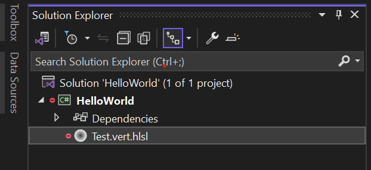
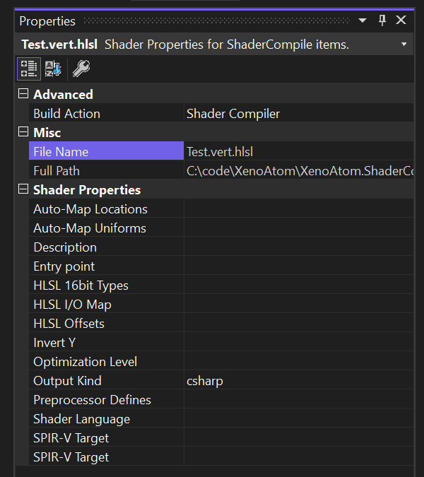

# XenoAtom.ShaderCompiler User Guide

This documentation is covering:

- The integration with MSBuild via the package `XenoAtom.ShaderCompiler.Build`.
- The `dotnet-shaderc` .NET tool.

- [MSBuild Integration](#msbuild-integration)
  - [Overview](#overview)
  - [Configuration](#configuration)
    - [Global Properties and Items](#global-properties-and-items)
    - [Per-File Properties](#per-file-properties)
  - [Advanced](#advanced)
- [`dotnet-shaderc` tool](#dotnet-shaderc-tool)
  - [Overview](#overview-1)
  - [Examples](#examples)


## MSBuild Integration

### Overview

* Add the NuGet package `XenoAtom.ShaderCompiler.Build` to your MSBuild project (C#, msproj...etc.)
* Add shaders files to your project. The package will recognize certain file extensions to automatically compile them as part of your project

  | GLSL Files   | HLSL Files    | Shader Stage
  |--------------|---------------|----------------
  | `*.vert`     | `*.vert.hlsl` | vertex
  | `*.frag`     | `*.frag.hlsl` | fragment
  | `*.comp`     | `*.comp.hlsl` | compute
  | `*.geom`     | `*.geom.hlsl` | geometry
  | `*.tesc`     | `*.tesc.hlsl` | tesscontrol
  | `*.tese`     | `*.tese.hlsl` | tesseval

  
* Within a C# project, it will automatically compile the shader to be embedded via C#:

  ```c#
  using System;
  
  namespace HelloWorld
  {
      internal static partial class CompiledShaders
      {
          #if NET5_0_OR_GREATER || NETSTANDARD2_1
          public static ReadOnlySpan<byte> Test_vert_hlsl => new byte[]
          #else
          public static readonly byte[] Test_vert_hlsl = new byte[]
          #endif
          {
              3, 2, 35, 7, 0, 0, 1, 0, 11, 0, 13, 0, 38, 0, 0, 0, 0, 0, 0, 0, 17, 0, 2, 0, 1, 0, 0, 0, 11, 0, 6, 0, 1, 0, 0, 0, 71, 76, 83, 76, 46, 115, 116, 100, 46, 52, 53, 48, 0, 0, 0, 0, 14, 0, 3, 0, 0, 0, 0, 0, 1, 0, 0, 0, 15, 0, 7, 0, 0, 0, 0, 0, 4, 0, 0, 0, 109, 97, 105, 110, 0, 0, 0, 0, 24, 0, 0, 0, 27, 0, 0, 0, 71, 0, 4, 0, 24, 0, 0, 0, 30, 0, 0, 0, 0, 0, 0, 0, 71, 0, 4, 0, 27, 0, 0, 0, 11, 0, 0, 0, 0, 0, 0, 0, 19, 0, 2, 0, 2, 0, 0, 0, 33, 0, 3, 0, 3, 0, 0, 0, 2, 0, 0, 0, 22, 0, 3, 0, 6, 0, 0, 0, 32, 0, 0, 0, 23, 0, 4, 0, 7, 0, 0, 0, 6, 0, 0, 0, 2, 0, 0, 0, 23, 0, 4, 0, 9, 0, 0, 0, 6, 0, 0, 0, 4, 0, 0, 0, 43, 0, 4, 0, 6, 0, 0, 0, 15, 0, 0, 0, 0, 0, 0, 0, 43, 0, 4, 0, 6, 0, 0, 0, 16, 0, 0, 0, 0, 0, 0, 64, 32, 0, 4, 0, 23, 0, 0, 0, 1, 0, 0, 0, 7, 0, 0, 0, 59, 0, 4, 0, 23, 0, 0, 0, 24, 0, 0, 0, 1, 0, 0, 0, 32, 0, 4, 0, 26, 0, 0, 0, 3, 0, 0, 0, 9, 0, 0, 0, 59, 0, 4, 0, 26, 0, 0, 0, 27, 0, 0, 0, 3, 0, 0, 0, 54, 0, 5, 0, 2, 0, 0, 0, 4, 0, 0, 0, 0, 0, 0, 0, 3, 0, 0, 0, 248, 0, 2, 0, 5, 0, 0, 0, 61, 0, 4, 0, 7, 0, 0, 0, 25, 0, 0, 0, 24, 0, 0, 0, 81, 0, 5, 0, 6, 0, 0, 0, 35, 0, 0, 0, 25, 0, 0, 0, 0, 0, 0, 0, 81, 0, 5, 0, 6, 0, 0, 0, 36, 0, 0, 0, 25, 0, 0, 0, 1, 0, 0, 0, 80, 0, 7, 0, 9, 0, 0, 0, 37, 0, 0, 0, 35, 0, 0, 0, 36, 0, 0, 0, 15, 0, 0, 0, 16, 0, 0, 0, 62, 0, 3, 0, 27, 0, 0, 0, 37, 0, 0, 0, 253, 0, 1, 0, 56, 0, 1, 0
          };
      }
  }
  ```
* Certain properties can be edited in the Visual Studio IDE Property editor when you select the shader file:
  
  
  Each of this properties map to item properties that can be edited directly from your MSBuild project.

[:top:](#xenoatomshadercompiler-user-guide)
### Configuration

#### Global Properties and Items

| Global Property Name                           | Description                                              | Default
| -----------------------------------------------|----------------------------------------------------------|-------------------
| `ShaderCompilerGlobalOption_root_namespace`    | Defines the namespace used for the C# source generator.  | `$(RootNamespace)`
| `ShaderCompilerGlobalOption_class_name`        | Defines the name of the generated C# class that will contain embedded compiled shaders. | `CompiledShaders`
| `EnableDefaultShaderCompileItems`              | A boolean indicating whether or not to create automatically `<ShaderCompile ...>` entries for known file extensions (e.g `.vert`, `.vert.hlsl`...) | `true`
| `ShaderCompilerGlobalOption_generate_hlsl_tools_config` | Generates a `shadertoolsconfig.json` used by the [HLSL Tools Extension](https://github.com/tgjones/HlslTools) for Visual Studio to allow defines and include directories to be transferred from MSBuild project to this file | `false`

For example, you can define these properties in your MSBuild project like this:

```xml
<Project Sdk="Microsoft.NET.Sdk">
  <PropertyGroup>
    <!-- ... -->

    <ShaderCompilerGlobalOption_root_namespace>MyCustomNamespace</ShaderCompilerGlobalOption_root_namespace>
    <ShaderCompilerGlobalOption_class_name>MyCompiledShaders</ShaderCompilerGlobalOption_class_name>
  </PropertyGroup>
  <!-- ... -->
</Project>
```

| Item Name                                      | Description                             |
| -----------------------------------------------|-----------------------------------------|
| `ShaderCompile`                                | Items included with this name will be compiled by the ShaderCompiler. By default, files with certain extensions (e.g `.vert`, `.vert.hlsl`) are created items to be compiled automatically.
| `ShaderCompilerGlobalOption_include_directory` | Adds an include directory to the include search path.

For example, you can define these properties in your MSBuild project like this:

```xml
<Project Sdk="Microsoft.NET.Sdk">
  
  <!-- ... -->

  <ItemGroup>
    <!-- Manually include recursively shaders to compile from another directory -->
    <ShaderCompile Include="../GlobalShaders/**/*.vert">
      <Link>%(RelativeDir)%(Filename)%(Extension)</Link>
    </ShaderCompile>

    <!-- Adds folder in the include search path -->
    <ShaderCompilerGlobalOption_include_directory Include="SharedIncludes"/>
  </ItemGroup>

</Project>
```

[:top:](#xenoatomshadercompiler-user-guide)
#### Per-File Properties

The following properties can be applied as global properties (inside a `PropertyGroup`) or as a metadata for a specific `<ShaderCompile>` item:

| Property Name                                  | Description                             | Default
| -----------------------------------------------|-----------------------------------------|-------------------
| `ShaderCompilerOption_defines`                 | Specifies the preprocessor defines for this file. Values are separated by `;`. For example: `MY_VALUE=1;ANOTHER_VALUE`.  | `(empty)`
| `ShaderCompilerOption_entry_point`             | Specifies the entry point name. This is only significant for HLSL compilation. The default is 'main'. | `main`
| `ShaderCompilerOption_output_kind`             | Specifies the kind of output for this shader. The default is embedded C# for C# projects, otherwise `content` (file as a Content in the output folder). | `csharp` (For C# projects)
| `ShaderCompilerOption_source_language`         | Specifies the language of the input shader files. The default is inferred from file extension. | `(empty)`
| `ShaderCompilerOption_optimization_level`      | Specifies which optimization level to use (`O`: performance, `Os`: speed, `O0`: zero). | `O`
| `ShaderCompilerOption_invert_y`                | Inverts position.Y output in a vertex shader. | `false`
| `ShaderCompilerOption_target_env`              | Specifies the SPIR-V language semantics. | `vulkan1.0`
| `ShaderCompilerOption_target_spv`              | Specifies the SPIR-V version to be used by the generated module. The defaults for specific Vulkan target environments are as follows: SPIR-V 1.0 for Vulkan 1.0, SPIR-V 1.3 for Vulkan 1.1, and SPIR-V 1.5 for Vulkan 1.2. | Depends on `target-env`
| `ShaderCompilerOption_auto_map_locations`      | For GLSL compilation, option -fauto-map-locations directs the compiler to automatically assign location numbers to user-defined stage input and output variables if not explicitly specified by the shader source. | `true` for HLSL
| `ShaderCompilerOption_auto_bind_uniforms`      | Directs the compiler to automatically assign binding numbers to uniform variables, when an explicit binding is not specified in the shader source. | `false`
| `ShaderCompilerOption_hlsl_16bit_types`        | Enables 16bit types for HLSL compilation. | `false`
| `ShaderCompilerOption_hlsl_offsets`            | Use HLSL packing rules instead of GLSL rules when determining offsets of members of blocks. This option is always on when compiling for HLSL. | `true` for HLSL
| `ShaderCompilerOption_hlsl_iomap`              | Directs the compiler to use HLSL register assignments as binding values. | `false`
| `ShaderCompilerOption_description`             | Specifies the description of this shader. The description will be used to generate a property summary description in the generated C# API. | `(empty)`

For example:

```xml
<Project Sdk="Microsoft.NET.Sdk">
  
  <PropertyGroup>
    <!-- Sets a default shader entry point name for all ShaderCompile items  -->
    <ShaderCompilerOption_entry_point>shader_main</ShaderCompilerOption_entry_point>    
  </PropertyGroup>

  <ItemGroup>
    <!-- Update a specific shaders with specific options -->
    <ShaderCompile Include="Test.vert.hlsl">
      <ShaderCompilerOption_description>This is a description of this special shader.</ShaderCompilerOption_description>
      <ShaderCompilerOption_defines>MY_DEFINE=1;MY_OTHER_DEFINE</ShaderCompilerOption_description>
    </ShaderCompile>

  </ItemGroup>

</Project>
```

[:top:](#xenoatomshadercompiler-user-guide)
### Advanced

#### Property `ShaderCompilerOption_output_kind`

This property allows to output a compiled shader to:

| Value    | Description
|----------|-------------------------------------------------------
|`csharp`  | To an embedded C# file using a Roslyn Source Generator. Default for C# projects.
|`content` | Copy the compiled shader file as-is to the output binary folder
|`tar`     | Embeds the compiled shader file into a `tar` archive
|`tar.gz`  | Embeds the compiled shader file into a `tar.gz` archive

When setting this property on `<ShaderCompile>` items, it will allow a same project to output shader files to different bucket (C#, content, tar...)

When dispatching to a `tar` / `tar.gz` the name of the archive will use the following convention:

`$(ShaderCompilerGlobalOption_root_namespace).$(ShaderCompilerGlobalOption_class_name).tar.gz`

or if `$(ShaderCompilerGlobalOption_root_namespace)` is empty:

`$(ShaderCompilerGlobalOption_class_name).tar.gz`


#### Property `ShaderCompilerOption_target_env`

The supported values are:

| Value       | Description
|-------------|-------------------------------------------------------
|`vulkan`     | Create SPIR-V under Vulkan 1.0 semantics.
|`vulkan1.0`  | Create SPIR-V under Vulkan 1.0 semantics.
|`vulkan1.1`  | Create SPIR-V under Vulkan 1.1 semantics.
|`vulkan1.2`  | Create SPIR-V under Vulkan 1.2 semantics.
|`opengl`     | Create SPIR-V under OpenGL 4.5 semantics.
|`opengl4.5`  | Create SPIR-V under OpenGL 4.5 semantics.

Generated code uses SPIR-V 1.0, except for code compiled for Vulkan 1.1, which uses SPIR-V 1.3, and code compiled for Vulkan 1.2, which uses SPIR-V 1.5.

If this option is not specified, a default of vulkan1.0 is used.

#### Property `ShaderCompilerOption_target_spv`

The supported values are: `spv1.0`, `spv1.1`, `spv1.2`, `spv1.3`, `spv1.4`, `spv1.5`, `spv1.6`.

The defaults for specific Vulkan target environments are as follows: SPIR-V 1.0 for Vulkan 1.0, SPIR-V 1.3 for Vulkan 1.1, and SPIR-V 1.5 for Vulkan 1.2.

[:top:](#xenoatomshadercompiler-user-guide)
## `dotnet-shaderc` tool

### Overview

This tool is similar to the [glslc](https://github.com/google/shaderc/tree/main/glslc) command line tool.

You can install this tool if you have the [.NET 8 SDK](https://dotnet.microsoft.com/en-us/download/dotnet/8.0) installed.


Installing this tool as a global tool:

```sh
$ dotnet tool -g dotnet-shaderc
```

Then you can run the `--help`

```sh
$ dotnet-shaderc --help
```

```
Usage: dotnet-shaderc [Options] input_file+

A command-line GLSL/HLSL to SPIR-V compiler with Clang-compatible arguments.

Overall Options:

  -h, -?, --help             Show this message and exit
  -v, --version              Show the version of this command
  -o=<output_file>           The SPIR-V <output_file>, expecting a single input
                               file.
      --batch=<file>         A batch <file> containing a JSON representation of
                               the items to compile.
      --generate-deps        Generates deps file used by build system.
      --max-thread-count=<number>
                             The maximum <number> of threads to use to compile
                               all the inputs. Default is 0 (Maximum number of
                               cores available)

Language and Mode Selection Options:

      --invert-y             Invert the Y axis of the coordinate system.
      --shader-stage=<stage> lets you specify the shader <stage> for one or
                               more inputs from the command line. Possible
                               values are: anyhit, callable, closesthit,
                               compute, fragment, geometry, intersection, miss,
                               raygen, tesscontrol, tesseval, vertex.
      --target-env=<value>   The target environment <value> for the shader.
                               Possible values are: opengl, opengl4.5, vulkan,
                               vulkan1.0, vulkan1.1, vulkan1.2.
      --target-spv=<version> Specify the SPIR-V <version> to be used by the
                               generated module. Possible values are: spv1.0,
                               spv1.1, spv1.2, spv1.3, spv1.4, spv1.5, spv1.6.
  -x=<lang>                  specify the <lang> of the input shader files.
                               Possible values are: glsl, hlsl.

Compilation Stage Selection Options:
  -c                         Run the preprocessing and compiling stage.
  -E                         Run the preprocessing stage.
  -S                         Run the preprocessing, compiling, and then
                               disassembling stage.

Preprocessor Options:
  -D, --define[=name:value]  Add a macro name and an optional value
  -I, --include-dir=<directory>
                             Adds the specified <directory> to the search path
                               for include files.

Code Generation Options:

  -g                         Generate debug information.
  -O[=VALUE]                 -O0 No optimization. This level generates the most
                               debuggable code. -Os Enables optimizations to
                               reduce code size. -O The default optimization
                               level for better performance.
      --hlsl-16bit-types     Enables 16bit types for HLSL compilation.
      --hlsl-offsets         Use HLSL packing rules instead of GLSL rules when
                               determining offsets of members of blocks. This
                               option is always on when compiling for HLSL.
      --hlsl-functionality1  Enable extension SPV_GOOGLE_hlsl_functionality1.
      --entry-point=<name>   The entry point function <name>.
      --auto-map-locations   Automatically assign locations to all shader
                               inputs and outputs. For HLSL compilation, this
                               option is on by default.
      --auto-bind-uniforms   Directs the compiler to automatically assign
                               binding numbers to uniform variables, when an
                               explicit binding is not specified in the shader
                               source.
  @file                      Read response file for more options.
```

[:top:](#xenoatomshadercompiler-user-guide)
### Examples

Compile a shader:

```sh
$ dotnet-shaderc Test.vert.hlsl
```

Compile a shader to a specific output file:

```sh
$ dotnet-shaderc Test.vert.hlsl -o my_vert.spv
```

To run the post preprocessor to the standard output:

```sh
$ dotnet-shaderc -E Test.vert.hlsl
```

To run the disassembler:

```sh
$ dotnet-shaderc -S Test.vert.hlsl -o my_vert.spvasm
```
[:top:](#xenoatomshadercompiler-user-guide)